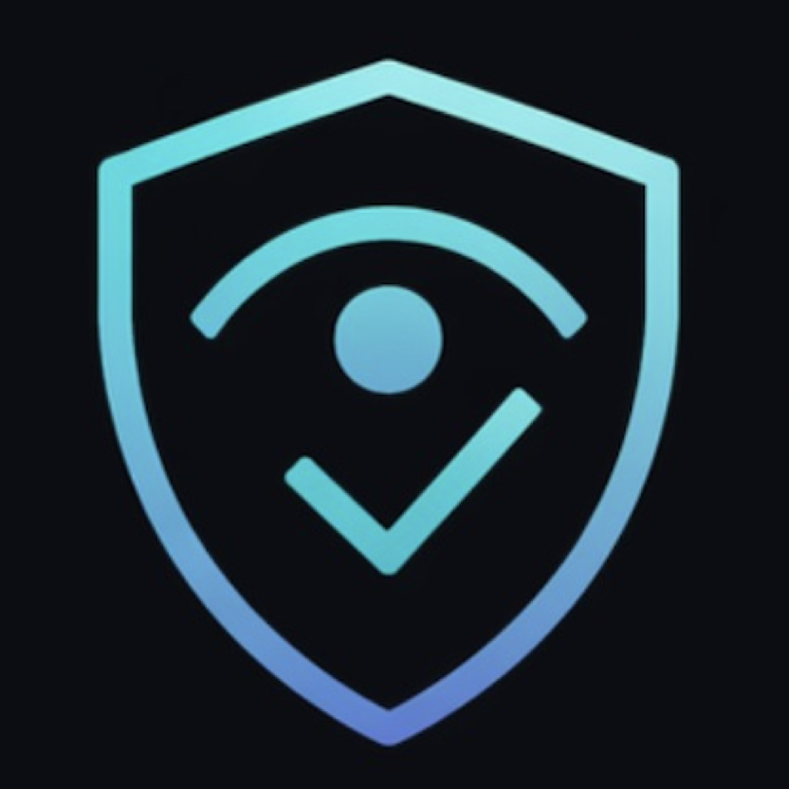
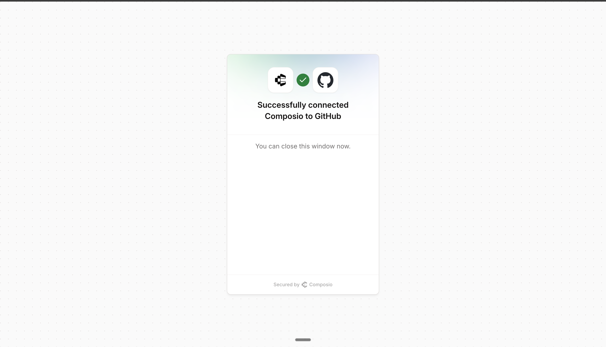
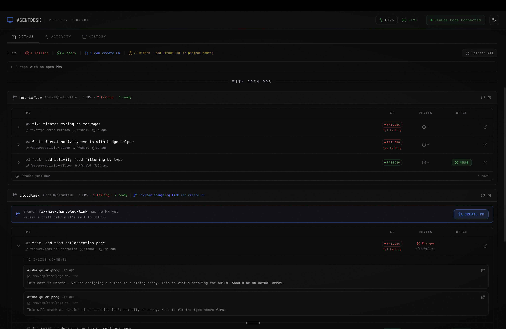
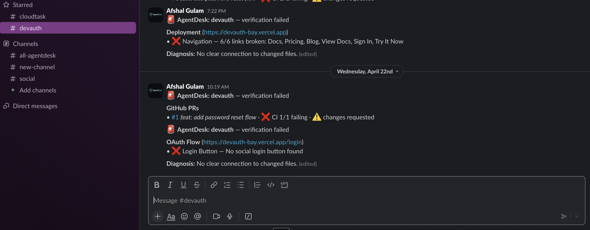
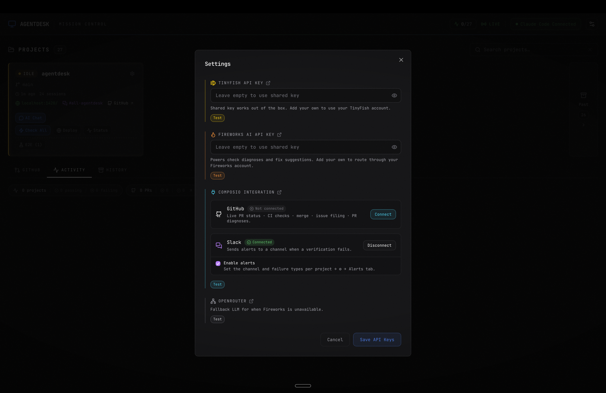

<p align="center">
  
</p>

# AgentDesk — Landing Page

*Built by [Afshal Gulam](https://github.com/AfshalG) ([LinkedIn](https://linkedin.com/in/afshal-g)) during the [TinyFish Web Agent Accelerator](https://tinyfish.ai) (Phase 2).*

Marketing site and download portal for **[AgentDesk](https://agentdesk-landing-iota.vercel.app)** — the verification layer for AI coding agents.

> Agents ship. AgentDesk verifies.
> A real browser verifies every push, diagnoses failures, drafts the fix, comments on the PR, ships the merge.

- **Live site:** https://agentdesk-landing-iota.vercel.app
- **Walkthrough video (5 min):** https://www.youtube.com/watch?v=HCJIK6J-JNU
- **Desktop app:** unsigned `.dmg`, macOS 13+ (Apple Silicon), distributed via [`AfshalG/agentdesk-releases`](https://github.com/AfshalG/agentdesk-releases)

The desktop app source is private during the TinyFish Accelerator. This repository is the public face: landing page, install instructions, changelog, traction page.

[](https://www.youtube.com/watch?v=HCJIK6J-JNU)

*5-minute walkthrough — see the verification loop, GitHub tab, Slack alerts, and Composio integration end-to-end.*


---

## Why this repo lives under `composio-community`

AgentDesk's GitHub and Slack integrations are built **entirely on [Composio](https://composio.dev)**. Every PR list, check-run poll, fork detection, issue file, OAuth handshake, and Slack alert in the desktop app is a Composio tool call. This README documents that integration so the repo can serve as a reference for other builders shipping production Composio integrations.

A short, honest version from the developer:

> Composio was the easiest part of building AgentDesk. Set up once, then both the GitHub layer and the Slack layer were just `execute_tool(slug, args)` calls. Listing every open PR across every project, fetching check runs, posting issues, sending Slack alerts — all of it returned in seconds. No SDK to wrap, no rate-limit dance, no per-endpoint client code. I could not have shipped this in two weeks without it.

### What's actually wired up

The desktop app is Tauri (Rust backend + React frontend). One file — `src-tauri/src/composio.rs` — owns every third-party call. It exposes a single typed helper:

```rust
pub async fn execute_tool<T: DeserializeOwned>(
    app: Option<&tauri::AppHandle>,
    tool_slug: &str,
    connection_id: Option<String>,
    user_id: Option<String>,
    arguments: JsonValue,
) -> Result<T, String>
```

Every feature listed below is built on top of that one function. No per-endpoint client, no generated bindings, no SDK to update. Adding a new GitHub or Slack capability is a matter of passing a different slug.

#### No Rust SDK? Didn't matter.

AgentDesk is a [Tauri](https://tauri.app) desktop app — Rust backend, WKWebView frontend, single binary on macOS. Composio doesn't publish a Rust SDK, and AgentDesk doesn't need one: every call is `POST https://backend.composio.dev/api/v3/tools/execute/{slug}` with an `x-api-key` header and a JSON body. The 30-line `execute_tool` helper above is the entire client. Same story would apply for Go, Swift, Elixir, or anything else with `reqwest`-shaped HTTP — Composio meets you where you are, not the other way around.

#### GitHub layer — 12 tool calls

Powers AgentDesk's GitHub tab, the PR row on every session card, and the post-failure intelligence flow:

| Composio tool | Where it shows up in the app |
| --- | --- |
| `GITHUB_LIST_PULL_REQUESTS` | "Every open PR across every project" view |
| `GITHUB_GET_A_REPOSITORY` | Fork detection (so AgentDesk knows whether to target `parent/repo` for actions) |
| `GITHUB_GET_A_PULL_REQUEST` | Per-PR mergeability + base-branch + head-SHA |
| `GITHUB_LIST_COMMITS_ON_A_PULL_REQUEST` | Builds the commit list for AI-polished merge messages |
| `GITHUB_LIST_REVIEWS_FOR_A_PULL_REQUEST` | Approved / changes-requested badges |
| `GITHUB_LIST_CHECK_RUNS_FOR_A_GIT_REFERENCE` | Live CI dot — polled after merge, fires "deployment live" toast |
| `GITHUB_GET_THE_COMBINED_STATUS_FOR_A_SPECIFIC_REFERENCE` | Legacy combined-status fallback alongside check runs |
| `GITHUB_CREATE_A_PULL_REQUEST` | Inline "Create PR" button with AI-polished title + body |
| `GITHUB_MERGE_A_PULL_REQUEST` | Inline squash-merge with editable AI-polished commit message |
| `GITHUB_CREATE_AN_ISSUE` | "File Issue" button auto-attaches the failure diagnosis |
| `GITHUB_LIST_REPOSITORY_ISSUES` | Dedup so we never file the same issue twice |
| (PR review comment) | "Comment Diagnosis on PR" button after a failing verification |

OAuth uses Composio's hosted `connect.composio.dev` flow — AgentDesk pops the browser, Composio handles the round-trip, the app polls `get_connection_status` until the connection goes ACTIVE, then persists the connection id. No callback server, no token refresh code, no scope-management UI to build.



*Composio's hosted success page after AgentDesk's "Connect GitHub" button. The entire OAuth round-trip happens here — AgentDesk only sees the resulting connection id.*



#### Slack layer — 2 tool calls

Per-project Slack alerts when verification fails:

| Composio tool | Where it shows up in the app |
| --- | --- |
| `SLACK_LIST_ALL_CHANNELS` | Channel picker in per-project alert config |
| `SLACK_SENDS_A_MESSAGE_TO_A_SLACK_CHANNEL` | Rich-formatted alert — failing checks, one-line diagnosis, commit SHA, deep-link back to the app |

Same OAuth pattern as GitHub. Two endpoints, ~80 lines of integration code, full Slack alerting feature.



*Two real failure alerts in the `#devauth` channel — Deployment + GitHub PRs + OAuth Flow checks, each with the failing step, the diagnosis, and a deep-link back to AgentDesk. All sent via one `SLACK_SENDS_A_MESSAGE_TO_A_SLACK_CHANNEL` call.*

#### What it looks like in the app

The Composio integration surfaces directly in AgentDesk's Settings panel — one click connects each service through Composio's hosted OAuth flow, and the same panel hosts the Slack channel picker and alert toggle.



#### Configuration

```rust
pub const GITHUB_AUTH_CONFIG_ID: &str = "ac_pymtjlNifblJ";
pub const SLACK_AUTH_CONFIG_ID:  &str = "ac_tPtLqbfpShRl";
```

A single workspace key (`ak_...`) ships with the app so users don't need to register anything to try it; advanced users can drop their own key into Settings.

### What this would have looked like without Composio

The other path: register two GitHub Apps + one Slack App, build a token-refresh background task, write a callback server (which AgentDesk doesn't have, since it's a native macOS app with no public URL), wrap the GitHub REST API for ~12 endpoints, wrap the Slack Web API for 2, handle pagination and rate-limit headers per-endpoint, then maintain all of that across breaking upstream changes.

Composio collapsed that to one helper function and two auth config IDs.

---

## Stack (this site)

- **Framework:** [Next.js 16](https://nextjs.org) (App Router) on React 19
- **Language:** TypeScript (strict)
- **Styling:** Tailwind CSS v4
- **Fonts:** [Geist](https://vercel.com/font)
- **Smooth scroll:** [Lenis](https://github.com/darkroomengineering/lenis)
- **Analytics:** Vercel Analytics
- **Hosting:** Vercel
- **Releases:** Cross-repo — landing page reads the latest `.dmg` from `AfshalG/agentdesk-releases` (public) so the private app repo can stay private

## Run locally

```bash
git clone https://github.com/composio-community/agentdesk-landing.git
cd agentdesk-landing
npm install
npm run dev
```

Open http://localhost:3000.

## Project structure

```
app/                  Next.js App Router entry (single home page)
components/           Section components — Hero, Walkthrough, LoopTimeline,
                      Traction, Pricing, ChangelogPreview, FinalCta, Footer, ...
lib/                  Helpers — GitHub release fetcher, links, markdown
public/assets/        Screenshots + partner logos
```

## Acknowledgements

Built during the **[TinyFish Web Agent Accelerator](https://tinyfish.ai)** (Phase 2). AgentDesk's core verification engine is the TinyFish Web Agent — the GitHub and Slack layers documented above are Composio.

Thanks to **[Sharath Kuruganty](https://x.com/sharathkuruganty)** at Composio for the partner credits and for inviting this repo into `composio-community/`.
